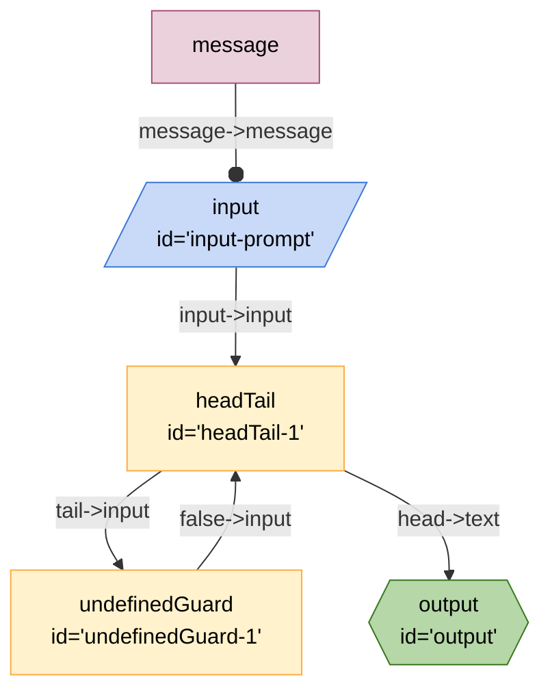

# "Google Labs Breadboard" Useful nodes by Paul Kinlan Kit 

This is a collection of [Breadboard](https://github.com/google/labs-prototypes/tree/main/seeds/breadboard) nodes that are helpful for building LLM-based (Generative AI) applications.

## Installing

This Kit requires Node version >=v19.0.0. To install:

```sh
npm install @paulkinlan/breadboard-utils-kit
```

## Node Types

Here are all node handlers that are included in the OpenAI Breadboard Kit

### The `undefinedGuard` node

Takes an `input` and if the value is `defined` (!undefined) then outputs the `input` on the false. If the value is `undefined` outputs `true` on "true" 

#### Inputs:

- `input` optional. The value to be checked if undefined.

#### Outputs:

- `true` - "true" if the input is `undefined`.
- `false` - value of the input if the input is not `undefined`.


### The `headTail` node

Takes a list as `input` and returns the first item as the head, and the rest of the list as tail.

#### Inputs:

- `input` required, must contain the OpenAI API key.

#### Outputs:

- `head` - the first item in the list
- `tail` - the rest of the input list (`slice(1)`)

## Example graph

